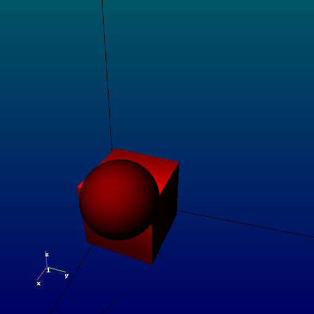

# pyscad
inprogress toy remix of openscad, openjscad, and python
## goals
- openscad like features
- openjscad like features (especially connectors)
- opengl web implementataion for chromebooks

## example
### (somewhat real, somewhat mocked up code)
```python
  o1 = cube(1, centered=True)
  o2 = cube(3, centered=True)
  o3 = sphere(2, centered=True)

  o4=union([o1,o2,o3])

  s = Scene()
  s.render(o4)
```


### connectors example
```python
  o = cylinder(h=20, centered=True)
  o.con = Connector([0,0,10], [0,0,1], [1,0,0])
  o2 = ((cube(4, centered=True) *2.5 - sphere(6))+ o).rotate(45, [1,1,1])

  print o2.con.point
  print o2.con.getTransformationTo(Connector([0,0,10], [0,0,1], [1,0,0]))
```
  
  
  

### openscad output example
```python
  s = o2.ouputOpenScad()
  with open('pyscadtestout.scad', 'w') as f:
    f.write('$fn=64;\n')
    f.write(s)
  

```
